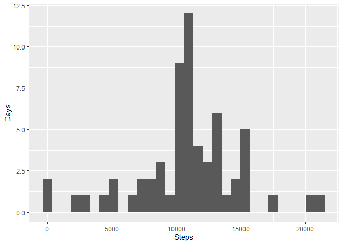

## Loading relevant libraries


```r
library(tidyverse)
```

```
## -- Attaching packages --------------------------------------------------------------------------------------------------------------------------- tidyverse 1.3.0 --
```

```
## v ggplot2 3.3.1     v purrr   0.3.4
## v tibble  3.0.1     v dplyr   1.0.0
## v tidyr   1.1.0     v stringr 1.4.0
## v readr   1.3.1     v forcats 0.5.0
```

```
## -- Conflicts ------------------------------------------------------------------------------------------------------------------------------ tidyverse_conflicts() --
## x dplyr::filter() masks stats::filter()
## x dplyr::lag()    masks stats::lag()
```

```r
library(doBy)
```

```
## 
## Attaching package: 'doBy'
```

```
## The following object is masked from 'package:dplyr':
## 
##     order_by
```

## Loading and preprocessing the data


```r
setwd("/Users/jesus/Documents/GitHub/RepData_PeerAssessment1/activity")
RawData<- read.csv("activity.csv",na.strings=("NA"))
```

## What is mean total number of steps taken per day?


```r
NaRemoved<-filter(RawData, (is.na(RawData$steps)==FALSE))
StepsPerDay<-summaryBy(steps~date,data=NaRemoved, FUN = sum)
ggplot(StepsPerDay, aes(x=steps.sum)) + geom_histogram()+xlab("Steps")+ylab("Days")
```

```
## `stat_bin()` using `bins = 30`. Pick better value with `binwidth`.
```

<!-- -->

```r
MeanSteps<-mean(StepsPerDay$steps.sum)
MedSteps<-median(StepsPerDay$steps.sum)

print(c("Mean steps taken is",MeanSteps))
```

```
## [1] "Mean steps taken is" "10766.1886792453"
```

```r
print(c("Median steps taken is",MedSteps))
```

```
## [1] "Median steps taken is" "10765"
```


## What is the average daily activity pattern?

```r
StepsPerInterval<-summaryBy(steps~interval,data=NaRemoved, FUN = mean)

# Converts from format hhmm to minutes
ConvertedSteps<-mutate(StepsPerInterval,interval = str_pad(interval,

                            width = 4,

                            side = "left",

                            pad = "0")) %>%

  extract(interval,

          into = c("hr", "min"),

          regex = "(\\d{2})(\\d{2})",

          convert = TRUE) %>%

  mutate(interval = (hr*60) + (min))

#graph of steps over the interval using minutes
ggplot(ConvertedSteps, aes(x=interval, y=steps.mean) )+geom_line()+xlab("Minutes")+ylab("steps")
```

<!-- -->

```r
#Calculation of which interval had the max steps taken using t
StepsPerInterval$interval[which.max(StepsPerInterval$steps.mean)]
```

```
## [1] 835
```
The interval with the max steps taken is reported by the code above as 835, indicating 8hours and 35 minutes.

## Imputing missing values


```r
#Calculation of number of missing values
print(nrow(RawData[is.na(RawData$steps)==TRUE,]))
```

```
## [1] 2304
```

```r
#Calculation of Steps/Interval of non-NA data
RawStepsPerInterval <- summaryBy(steps~interval,data=NaRemoved, FUN = mean)

#Creation of Imputed Data set
MergedResults<-merge(RawData,RawStepsPerInterval, by.x = "interval", by.y = "interval", all.x=TRUE)
MergedResults$ImputedSteps<-coalesce(MergedResults$steps,MergedResults$steps.mean)

ImputedData<-summaryBy(ImputedSteps~date,data=MergedResults, FUN = sum)

#Histogram plot of Imputed Data Set Steps per Day
ggplot(ImputedData, aes(x=ImputedSteps.sum))+geom_histogram()+xlab("Steps")+ylab("Days")
```

```
## `stat_bin()` using `bins = 30`. Pick better value with `binwidth`.
```

<!-- -->

```r
ImputedMeanSteps<-mean(ImputedData$ImputedSteps.sum)
ImputedMedSteps<-median(ImputedData$ImputedSteps.sum)

print(c("Mean steps taken is",ImputedMeanSteps))
```

```
## [1] "Mean steps taken is" "10766.1886792453"
```

```r
print(c("Median steps taken is",ImputedMedSteps))
```

```
## [1] "Median steps taken is" "10766.1886792453"
```
By imputing the data, we see that the shape of the histogram does not change drastically indicating minimal change of estimates.The mean and the median become equal.


## Are there differences in activity patterns between weekdays and weekends?

```r
WeekendData<-MergedResults %>%

  mutate(date=as.POSIXct(date), Day=weekdays(date)) %>%


  mutate(DayType= if_else(Day=="Saturday"| Day=="Sunday","weekend","weekday") ) %>%

mutate(intervalMin = str_pad(interval,

                            width = 4,

                            side = "left",

                            pad = "0")) %>%

  extract(intervalMin,

          into = c("hr", "min"),

          regex = "(\\d{2})(\\d{2})",

          convert = TRUE) %>%

  mutate(intervalMin = (hr*60) + (min)) %>%
  group_by(DayType, intervalMin) %>%
  summarize(MeanSteps=mean(ImputedSteps))
```

```
## `summarise()` regrouping output by 'DayType' (override with `.groups` argument)
```

```r
ggplot(WeekendData, aes(x=intervalMin, y=MeanSteps) )+geom_line()+xlab("Minutes")+ylab("steps")+facet_wrap(~DayType,ncol = 1)
```

<!-- -->


Activity starts earlier on weekdays, has a greater step/interval maximum, but ends earlier. Activity is spread throughout the weekend
